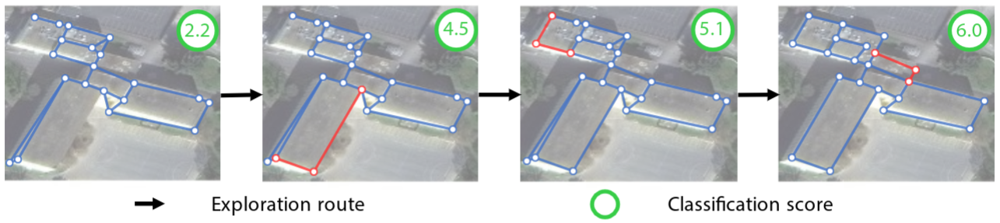

# Structured Outdoor Architecture Reconstruction by Exploration and Classification

Fuyang Zhang, Xiang Xu, Nelson Nauata, Yasutaka Furukawa.


[[`arXiv`](https://arxiv.org/abs/2108.07990)]
[[`Project Page`](xxx)]
[[`Bibtex`](#Citing)]

In ICCV 2021

[](https://arxiv.org/abs/2108.07990)

## Prerequisites
- Linux
- NVIDIA GPU + CUDA CuDNN
- Python 3.7+, PyTorch 1.7+

## Dependencies

Install python package dependencies:

```bash
$ pip install -r requirements.txt
```


## Data 
Download the processed data from this [link]() (1GB). This includes the original cities dataset from ["Vectorizing World Buildings: Planar Graph Reconstruction by Primitive Detection and Relationship Classification"](https://arxiv.org/abs/1912.05135) and predictions from Conv-MPN / IP / Per-edge methods.

You can also download the original data from this [link](https://www.dropbox.com/sh/q1jmqnm26q21h1a/AABtxO0Uni9eZs-Qs37HJTJLa?dl=0).

## Running the Code

### Training
```
python train_evaluators.py
```

You can change the configurations in `config.py`.

### Evaluation
First, perform search over the test data:

```
python search_result.py
```

Then, evaluate scores using:
```
python metric_for_result.py
```

## Pretrained models
We provide pretrained models here...


## <a name="Citing"></a>Citation
If you use find this code helpful, please consider citing:
```BibTeX
@InProceedings{zhang2021structured,
      title={Structured Outdoor Architecture Reconstruction by Exploration and Classification}, 
      author={Fuyang Zhang and Xiang Xu and Nelson Nauata and Yasutaka Furukawa},
      year={2021},
      eprint={2108.07990},
      archivePrefix={International Conference on Computer Vision (ICCV)},
      primaryClass={cs.CV}
}
```
## Contact
If you have any questions, please contact fuyangz@sfu.ca or xuxiangx@sfu.ca

